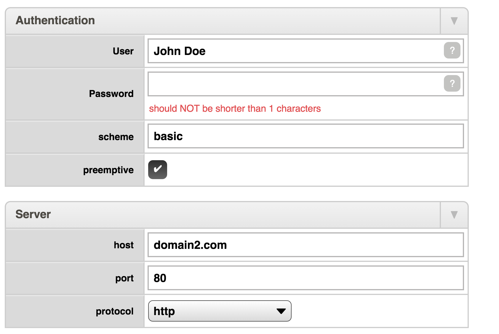

# json-schema-js-gui-model

Use this library typescript/javascript library when you need to construct many different custom UI forms that shares common
characteristics, want to be in charge of how exactly your UI form should present itself, want to
pick your own web framework for the UI, and want to use a json schema to drive the UI forms
but finds json schema complex to process and lacking of UI information.

This library contains a handy framework-agnostic gui model and associated translator that can be used as a basis when constructing 
dynamic javascript UI forms (in any web framework) from json-schemas. For details, refer to the declared gui
model [here](src/lib/gui-model.ts) and the translator declared at the bottom of this [file](src/lib/gui-model.mapper.ts).

Clients of this library are themselves responsible for constructing a UI form
dynamically using the gui model provided by this library. Such UI code will be
different depending on the exact web framework used and this out of scope of this more
fundamental and general project.

This library is on purpose keept small with few runtime-dependencies. It can be used from both nodejs v6+ 
and with a es5 capable browser.

## Getting started

```npm install json-schema-js-gui-model```

Schemas can be translated using the exported GuiModelMapper class or by the the command line
command *mapToGuiModel* when the library is installed with -g option by npm.

Code (typescript example):
```typescript
import { GuiModelMapper, GuiModel, JsonSchema } from 'json-schema-js-gui-model';

let mapper: GuiModelMapper = new GuiModelMapper();
let input: JsonSchema = ... schema ...
let output: GuiModel = mapper.mapToGuiModel(input);

```

Command-line: (requires global npm install)
```
mapToGuiModel sourceSchema destFile
```

## The gui model and it's usage

The gui model is intended for easy consumption when visualizing a UI form. The gui model does not
contain any validation elements. 

The constructed UI should still use the json schema for validation purposes. If the form is 
carefully constructed the output will conform to the underlaying json schema when valid. A fast
schema validator like [ajv](https://github.com/epoberezkin/ajv) can easily do validation of a form 
in realtime at each keypress if necessary. 

## Example from schema to gui model to ui form:

**Example input schema:**
```
{
  "$schema": "http://json-schema.org/draft-04/schema#",
  "type": "object",
  "properties": {
    "authentication": {
      "type": "object",
      "title": "Authentication",
      "description": "an authentication description here",
      "properties": {
        "user": {
          "type": "string",
          "minLength": 1,
          "default": "",
          "title" : "User",
          "description": "a username"
        },
        "password": {
          "type": "string",
          "minLength": 1,
          "default": "",
          "title" : "Password",
          "description": "a password"
        },
        "scheme": {
          "type": "string",
          "default": "basic"
        },
        "preemptive": {
          "type": "boolean",
          "default": true
        }
      },
      "required": [
        "user",
        "password"
      ]
    },
    "server": {
      "type": "object",
      "title": "Server",
      "properties": {
        "host": {
          "type": "string",
          "default": ""
        },
        "port": {
          "type": "integer",
          "multipleOf": 1,
          "maximum": 65535,
          "minimum": 0,
          "exclusiveMaximum": false,
          "exclusiveMinimum": false,
          "default": 80
        },
        "protocol": {
          "type": "string",
          "default": "http",
          "enum" : ["http", "ftp"]
        }
      }
    }
  }
}
```

**Example gui model output:**
```
{
  "kind": "group",
  "name": "",
  "controlType": "group",
  "dataObjectPath": "",
  "label": "",
  "tooltip": "",
  "required": true,
  "elements": [
    {
      "kind": "group",
      "name": "authentication",
      "controlType": "group",
      "dataObjectPath": "authentication",
      "label": "Authentication",
      "tooltip": "an authentication description here",
      "required": false,
      "elements": [
        {
          "kind": "field",
          "name": "user",
          "controlType": "input",
          "label": "User",
          "tooltip": "a username",
          "dataObjectPath": "authentication.user",
          "defaultValue": "",
          "required": true,
          "type": "string",
          "subType": "none"
        },
        {
          "kind": "field",
          "name": "password",
          "controlType": "input",
          "label": "Password",
          "tooltip": "a password",
          "dataObjectPath": "authentication.password",
          "defaultValue": "",
          "required": true,
          "type": "string",
          "subType": "none"
        },
        {
          "kind": "field",
          "name": "scheme",
          "controlType": "input",
          "label": "scheme",
          "tooltip": "",
          "dataObjectPath": "authentication.scheme",
          "defaultValue": "basic",
          "required": false,
          "type": "string",
          "subType": "none"
        },
        {
          "kind": "field",
          "name": "preemptive",
          "controlType": "yesno",
          "label": "preemptive",
          "tooltip": "",
          "dataObjectPath": "authentication.preemptive",
          "defaultValue": true,
          "required": false,
          "type": "boolean",
          "subType": "none"
        }
      ]
    },
    {
      "kind": "group",
      "name": "server",
      "controlType": "group",
      "dataObjectPath": "server",
      "label": "Server",
      "tooltip": "",
      "required": false,
      "elements": [
        {
          "kind": "field",
          "name": "host",
          "controlType": "input",
          "label": "host",
          "tooltip": "",
          "dataObjectPath": "server.host",
          "defaultValue": "",
          "required": false,
          "type": "string",
          "subType": "none"
        },
        {
          "kind": "field",
          "name": "port",
          "controlType": "input",
          "label": "port",
          "tooltip": "",
          "dataObjectPath": "server.port",
          "defaultValue": 80,
          "required": false,
          "type": "integer",
          "subType": "none"
        },
        {
          "kind": "field",
          "name": "protocol",
          "controlType": "dropdown",
          "label": "protocol",
          "tooltip": "",
          "dataObjectPath": "server.protocol",
          "defaultValue": "http",
          "values": [
            "http",
            "ftp"
          ],
          "required": false,
          "type": "string",
          "subType": "none"
        }
      ]
    }
  ],
  "errors": []
}
```

**Example of a corresponding UI form (for illustration only - not provided by this library):**




## Status and future plans

The current version appears to work fine in my own project but has not been tested beyond that. Some advanced
schema constructs like links are not yet supported.

I am considering to support some kind of json schema ui extensions in order to construct a even more detailed gui model.


